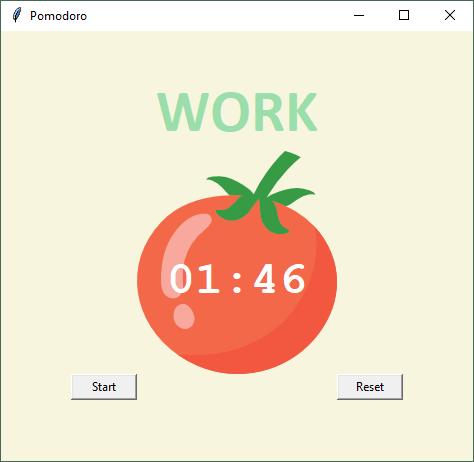
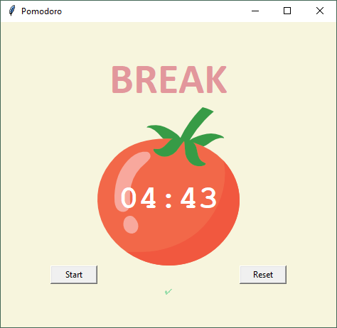

# Pomodoro
> It's a pomodoro app.

## Table of contents
* [General info](#general-info)
* [Screenshots](#screenshots)
* [Technologies](#technologies)
* [Setup](#setup)
* [Status](#status)

## General info
The Pomodoro Technique is a time management method. The technique uses a timer to break down work into intervals,
traditionally 25 minutes in length, separated by short breaks. If you want to learn more about go ahead adn check it on [wiki](https://en.wikipedia.org/wiki/Pomodoro_Technique)

Click start when you are ready to begin your work in pomodoro's way!
After 25 min there will be a 5 min break, every 4'th break is longer.

Main goal of the project was to get along with Tkinter library.

## Screenshots
\
\

## Technologies
* Python 3.8
* Tkinter 8.5

## Setup
Install missing libraries if necessary.

## Status
Project is: _finished_.
